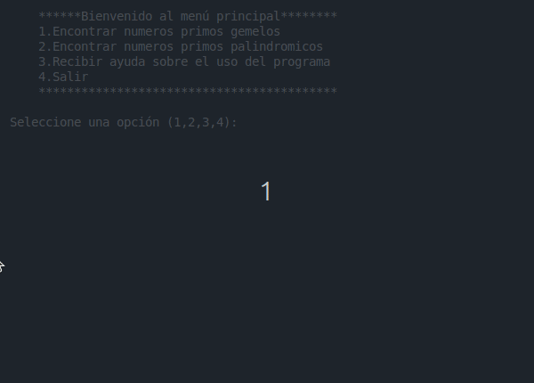

# 📌 Números Primos Especiales

Este proyecto es una aplicación en consola que permite encontrar números primos gemelos y palíndromos dentro de un rango específico. Además, proporciona una guía interactiva para ayudar al usuario durante su uso.

---

## 🖼️ Vista Previa



---

## 🚀 Características

✅ Encuentra números primos gemelos

✅ Encuentra números primos palíndromos

✅ Interfaz en consola fácil de usar

## 🛠️ Tecnologías Utilizadas

Este proyecto fue desarrollado con las siguientes tecnologías:

- [✔] Python 3

- [✔] Funciones puras y estructuras condicionales

- [✔] Entrada/Salida por consola

## 📦 Instalación

Sigue estos pasos para instalar y ejecutar el proyecto en tu máquina local:

1. Clona el repositorio:
```sh
git clone https://github.com/Alexis-Blanco/Quiz-Python_Alexis_Blanco.git
```

2. Entra en el directorio del proyecto:
```sh
cd Quiz-Python_Alexis_Blanco
```

3. Ejecuta el proyecto:
```sh
python main.py
```

## 📂 Estructura del Proyecto

/special-prime-numbers
│── funcions.py
│── main.py
│── README.md
│── LICENSE
│── assets/
    └── preview_prime_numbers.gif

## 📝 Uso

1: Ejecuta el archivo main.py

2: Selecciona una opción del menú:

·Buscar primos gemelos

·Buscar primos palíndromos

3: Introduce el rango numérico solicitado para realizar la búsqueda.

4: Si lo necesitas, escoge la opción 3 para ver ayuda

5: Salir


## 🤝 Contribución

Si deseas contribuir, sigue estos pasos:

1. Haz un fork del proyecto

2. Crea una nueva rama (git checkout -b feature/nueva-feature)

3. Realiza tus cambios y haz commit (git commit -m "Agrega nueva funcionalidad")

4. Sube tu rama (git push origin feature/nueva-feature)

5. Asegúrate que tu código funciona antes de enviar un PR.

6. Describe claramente los cambios en el Pull Request.

7. No olvides agregar documentación si es necesario.

## 📄 Licencia

Este proyecto está bajo la licencia MPL-2.0 - consulta el archivo [LICENSE](LICENSE) para más detalles.

## 📩 Contacto

Si tienes preguntas o sugerencias, contáctame en blancogomezy@gmail.com
